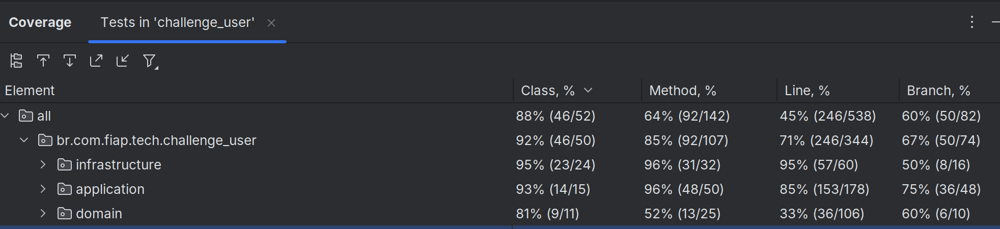

# PROJETO: Tech-Challenge-ADJ-Fiap

Equipe: Junior Martins (rm364241)


## Índice
1. Introdução;
2. Arquitetura do Sistema;
3. Descrição dos Endpoints da API;
4. Configuração do Projeto;
5. Qualidade do Código;
6. Collections para Teste;
7. Notas;
8. Autoria.


## Introdução

#### Descrição do problema:

Na nossa região, um grupo de restaurantes decidiu contratar estudantes
para construir um sistema de gestão para seus estabelecimentos. Essa decisão
foi motivada pelo alto custo de sistemas individuais, o que levou os restaurantes
a se unirem para desenvolver um sistema único e compartilhado. Esse sistema
permitirá que os clientes escolham restaurantes com base na comida oferecida,
em vez de se basearem na qualidade do sistema de gestão.

O objetivo é criar um sistema robusto que permita a todos os restaurantes
gerenciar eficientemente suas operações, enquanto os clientes poderão
consultar informações, deixar avaliações e fazer pedidos online. Devido à
limitação de recursos financeiros, foi acordado que a entrega do sistema será
realizada em fases, garantindo que cada etapa seja desenvolvida de forma
cuidadosa e eficaz.

A divisão em fases possibilitará uma implementação gradual e controlada,
permitindo ajustes e melhorias contínuas conforme o sistema for sendo usado
e avaliado tanto pelos restaurantes quanto pelos clientes.

#### Objetivo do projeto:

Desenvolver um backend completo e robusto utilizando o framework Spring Boot, 
com foco no gerenciamento de Usuários, Restaurantes e Cardápios, incluindo 
operações de criação, atualização, exclusão e consulta. O projeto será 
configurado para rodar em um ambiente Docker, utilizando Docker Compose, o 
que permitirá a orquestração dos serviços e a integração com um banco de dados 
relacional, como PostgreSQL, MySQL ou H2. A configuração com Docker Compose 
garantirá que a aplicação seja facilmente replicável e escalável, permitindo a 
implantação em diversos ambientes de forma consistente e eficiente. Além disso, 
o projeto será desenvolvido seguindo as melhores práticas de arquitetura e 
segurança, de modo que o sistema seja não apenas funcional, mas também seguro, 
escalável e de fácil manutenção. Bem como, são incluídos requisitos técnicos 
para garantir que o sistema mantenha alta qualidade e organização, com suporte 
para documentação e testes automatizados


## Arquitetura do Sistema

#### Descrição da Arquitetura 

- Ports and Adapters (Arquitetura Hexagonal):

A aplicação utiliza o padrão Ports and Adapters, onde as portas definem contratos entre camadas.

Portas de Entrada: Interfaces com sufixo InputPort permitem que a camada de Infraestrutura acesse a lógica 
de negócio.

Portas de Saída: Interfaces com o sufixo OutputPort permitem que a camada de negócio acesse a persistência 
sem depender de detalhes de implementação.

Adaptadores: classes com o sufixo Controller (adaptadores de entrada) traduzem requisições HTTP em chamadas 
às portas de entrada, enquanto classes com sufixo Adapter (adaptadores de saída) traduzem chamadas das 
portas de saída em operações de banco de dados.

- Clean Architecture:

A aplicação segue princípios da Clean Architecture, com as regras de negócio (Application e Domain) no 
centro, independente de detalhes de infraestrutura. A persistência e a apresentação são externas e dependem 
do núcleo por meio de interfaces.

Exemplo: A lógica de negócio não depende diretamente de Spring Data JPA ou do framework HTTP, mas de 
interfaces abstratas (OutputPort).

#### Diagrama da Arquitetura


Imagem de autoria do responsável pelo projeto. Desenvolvida por meio do software StarUML. 

## Descrição dos Endpoints da API e exemplos

|       Recurso       |               Endpoint                |                     Descrição                     |
|---------------------|---------------------------------------|---------------------------------------------------|
| Cliente             | /api/v1/challenge-user/clientes       | Endpoint para operações de CRUD de Clientes       |
| Proprietario        | /api/v1/challenge-user/proprietarios  | Endpoint para operações de CRUD de Proprietários  |
| Restaurante         | /api/v1/challenge-user/restaurantes   | Endpoint para operações de CRUD de Restaurantes   |
| Item                | /api/v1/challenge-user/itens          | Endpoint para operações de CRUD de Itens          |


| Método    | Endpoint e Requisição                                                                                                          |              Resposta                     |
|-----------|--------------------------------------------------------------------------------------------------------------------------------|-------------------------------------------|
| Delete    | http://localhost:9050/api/v1/challenge-user/clientes/6d648275-37d9-4fd3-800f-025a2262ef4d                                      |           204 No Content                  |
| Get       | http://localhost:9050/api/v1/challenge-user/clientes/a546ef31-d9f4-4ff7-9665-4baed324920b                                      |    200 OK + Json no body (resposta 1)     |
| Post      | http://localhost:9050/api/v1/challenge-user/clientes                                           (+ Json no body - requisição 1) |  201 Created + Json no body (resposta 2)  |
| Put       | http://localhost:9050/api/v1/challenge-user/clientes/a90902fa-7cce-4c17-87fd-5cd9c70c9d5a      (+ Json no body - requisição 1) |    200 OK + Json no body (resposta 2)     |
| Patch     | http://localhost:9050/api/v1/challenge-user/clientes                                           (+ Json no body - requisição 3) |           204 No Content                  |
| Delete    | http://localhost:9050/api/v1/challenge-user/proprietarios/051f5dc8-74fe-4d2c-81e2-ddea7c515532                                 |           204 No Content                  |
| Get       | http://localhost:9050/api/v1/challenge-user/proprietarios/eb957f38-90c4-4ef2-850c-229fb1658fcd                                 |    200 OK + Json no body (resposta 3)     |
| Post      | http://localhost:9050/api/v1/challenge-user/proprietarios                                      (+ Json no body - requisição 2) |  201 Created + Json no body (resposta 4)  |
| Put       | http://localhost:9050/api/v1/challenge-user/proprietarios/bc11e003-219d-4884-88e9-e2a0b43d42c7 (+ Json no body - requisição 2) |    200 OK + Json no body (resposta 4)     |
| Patch     | http://localhost:9050/api/v1/challenge-user/proprietarios                                      (+ Json no body - requisição 3) |           204 No Content                  |
| Delete    | http://localhost:9050/api/v1/challenge-user/restaurantes/6bfe2290-0720-4c58-89d7-902698778e59                                  |           204 No Content                  |
| Get       | http://localhost:9050/api/v1/challenge-user/restaurantes/b173aa00-d852-4ff2-86aa-ce657136a44a                                  |    200 OK + Json no body (resposta 5)     |
| Post      | http://localhost:9050/api/v1/challenge-user/restaurantes                                       (+ Json no body - requisição 4) |  201 Created + Json no body (resposta 5)  |
| Put       | http://localhost:9050/api/v1/challenge-user/restaurantes/63fd1b44-4fd9-4d67-95d9-9a4607409c79  (+ Json no body - requisição 4) |    200 OK + Json no body (resposta 5)     |
| Delete    | http://localhost:9050/api/v1/challenge-user/itens                                                                              |           204 No Content                  |
| Get       | http://localhost:9050/api/v1/challenge-user/itens/2fe3e028-7983-437a-9f9a-a1240314167d                                         |    200 OK + Json no body (resposta 6)     |
| Post      | http://localhost:9050/api/v1/challenge-user/itens                                              (+ Json no body - requisição 5) |  201 Created + Json no body (resposta 6)  |
| Put       | http://localhost:9050/api/v1/challenge-user/itens/350d7035-e940-4394-a0db-72fec01c60b9         (+ Json no body - requisição 5) |    200 OK + Json no body (resposta 6)     |

##### Resposta 1 #####
```
{
    "usuarioId": "a546ef31-d9f4-4ff7-9665-4baed324920b",
    "nome": "Carl Friedrich Gauss",
    "email": "gauss@email.com",
    "login": "gauss",
    "senha": "gauss123",
    "dataHoraCriacao": "2023-10-01T12:00:00.000+00:00",
    "dataHoraEdicao": "2024-10-01T12:00:00.000+00:00",
    "endereco": {
        "enderecoId": "4f50648e-639d-423a-9a46-f4a8d1e96b07",
        "cep": "69905-169",
        "logradouro": "Travessa Nilo Bezerra",
        "numero": "500"
    },
    "numeroCartaoFidelidade": "4321-1234-001"
}
```

##### Requisição 1 #####
```
{
    "nome":"Rozenn Morgat",
    "email":"morgat@email.com",
    "login":"morgat",
    "senha":"morgat123",
    "numeroCartaoFidelidade": "1234-0000-5514",
    "endereco": {
        "cep": "78000-100",
        "logradouro": "Rua Centro",
        "numero": "100"
    }
}
```

##### Resposta 2 #####
```
{
    "usuarioId": "2827fdc3-ffac-44d9-92ce-b49680914da4",
    "nome": "Rozenn Morgat",
    "email": "morgat@email.com",
    "login": "morgat",
    "senha": "morgat123",
    "endereco": {
        "enderecoId": "ea98e788-ab70-4439-a312-7627a8d70b8b",
        "cep": "78000-100",
        "logradouro": "Rua Centro",
        "numero": "100"
    },
    "numeroCartaoFidelidade": "1234-0000-5514"
}
```

##### Resposta 3 #####
```
{
    "usuarioId": "eb957f38-90c4-4ef2-850c-229fb1658fcd",
    "nome": "Linus Pauling",
    "email": "linus@email.com",
    "login": "linus",
    "senha": "linus123",
    "dataHoraCriacao": "2023-10-01T12:00:00.000+00:00",
    "dataHoraEdicao": "2024-11-03T12:00:00.000+00:00",
    "endereco": {
        "enderecoId": "eac614d5-c70b-4b36-b4c8-7560f6f0eef9",
        "cep": "69905-169",
        "logradouro": "Rua Antônio Francisco das Chagas",
        "numero": "100"
    },
    "descricao": "Toda segunda na empresa"
}
```

##### Requisição 2 #####
```
{
    "nome": "Mike Beedle",
    "email": "mike@email.com",
    "login": "mike12",
    "senha": "123456",
    "descricao": "Presente pela tarde",
    "endereco": {
        "cep": "78050-120",
        "logradouro": "Rua Centro 2",
        "numero": "130"
    }
}
```

##### Resposta 4 #####
```
{
    "usuarioId": "0bfad517-dd66-49b3-a485-a5d6b105fac7",
    "nome": "Mike Beedle",
    "email": "mike@email.com",
    "login": "mike12",
    "senha": "123456",
    "endereco": {
        "enderecoId": "3ed4a907-ac36-4ea6-b6e7-0d17ba24d7a9",
        "cep": "78050-120",
        "logradouro": "Rua Centro 2",
        "numero": "130"
    },
    "descricao": "Presente pela tarde"
}
```

##### Requisição 3 #####
```
{
    "usuarioId":"86522917-f507-459a-8ef9-93015089a5b2",
    "senhaAntiga":"brian123",
    "senhaNova":"brian123"
}
```

##### Requisição 4 #####
```
{
    "nome": "Panela Velha",
    "tipoCozinhaEnum": "FAST_FOOD",
    "endereco": {
        "cep": "78000-100",
        "logradouro": "Rua Centro",
        "numero": "100"
    },
    "proprietario": "b69e9f12-e489-4751-9b24-a936c4f3c4d2"
}
```

##### Resposta 5 #####
```
{
    "restauranteId": "4fc0503e-68f3-42be-be79-b2eed500bd94",
    "nome": "Panela Velha",
    "tipoCozinhaEnum": "FAST_FOOD",
    "endereco": {
        "enderecoId": "2ca3a63e-1e5d-473f-8ed1-ba14c0f949cd",
        "cep": "78000-100",
        "logradouro": "Rua Centro",
        "numero": "100"
    },
    "proprietario": {
        "usuarioId": "b69e9f12-e489-4751-9b24-a936c4f3c4d2",
        "nome": "Andrew S. Tanenbaum",
        "email": "tanenbaum@email.com",
        "login": "tanenbaum",
        "senha": "tanenbaum12",
        "descricao": "Porteiro"
    }
}
```

##### Requisição 5 #####
```
{
    "nome": "Bife à Milanesa",
    "descricao": "Carne bovina com ovo",
    "preco": "232.05",
    "entrega": true,
    "foto": "http://link-foto-teste.com"
}
```

##### Resposta 6 #####
```
{
    "itemId": "64eb1ea5-f17b-4ddf-8bc0-e58e4ea1fc33",
    "nome": "Bife à Milanesa",
    "descricao": "Carne bovina com ovo",
    "preco": 232.05,
    "entrega": true,
    "foto": "http://link-foto-teste.com"
}
```

Mais informações podem ser adquiridas via Swagger (rode o docker compose): http://localhost:9050/swagger-ui/index.html


## Configuração do Projeto

#### Configuração do Docker Compose

```
name: fiap_technical_challenge_adj

volumes:
  database_user:
    name: database_user

networks:
  net_applications: # conexão com infra-local e acesso a internet - tipo bridge
    name: net_applications
    driver: bridge

services:

  challenge_user:
    container_name: challenge_user
    image: juniorsmartins/challenge_user:v0.0.5
    build:
      context: ../challenge_user/
      dockerfile: Dockerfile
      args:
        APP_NAME: "challenge_user"
        APP_VERSION: "v0.0.5"
        APP_DESCRIPTION: "Serviço de Crud de usuários e restaurantes."
    ports:
      - "9050:9050"
    deploy:
      resources:
        limits:
          cpus: '1.0'
          memory: 512M
    environment:
      - DB_HOST=challenge_data_user
      - DB_NAME=challenge_user
      - DB_PORT=5432
    restart: on-failure
    networks:
      - net_applications
    depends_on:
      challenge_data_user:
        condition: service_started

  challenge_data_user:
    container_name: challenge_data_user
    image: postgres:16.0
    ports:
      - "5501:5432"
    deploy:
      resources:
        limits:
          cpus: '0.5'
          memory: 512M
    restart: on-failure
    environment:
      - POSTGRES_DB=challenge_user
      - POSTGRES_USER=postgres
      - POSTGRES_PASSWORD=postgres
    volumes:
      - database_user:/var/lib/postgresql/data
    networks:
      - net_applications
```

#### Instruções para execução local

- Passo 1: clone o projeto;
- Passo 2: abra o projeto na IDEA;
- Passo 3: abra o terminal da IDEA;
- Passo 4: entre no diretório docker;
- Passo 5: rode o comando no diretório docker: docker compose up --build -d


## Qualidade do Código

#### Boas Práticas Utilizadas

##### Clean Code

- Nomes Significativos:
Prática: Use nomes de variáveis, métodos e classes que revelem claramente sua intenção e propósito. Evite abreviações ambíguas
ou nomes genéricos como data ou temp.

- Funções Pequenas e Focadas:
Prática: Escreva métodos curtos que façam apenas uma coisa e a façam bem. Evite métodos longos com múltiplas responsabilidades.

- Formatação Consistente:
Prática: Siga um padrão de formatação consistente, como indentação de 2 ou 4 espaços e organização lógica de classes (atributos,
construtores, métodos).

- Tratamento de Erros:
Prática: Use exceções em vez de códigos de erro e forneça mensagens claras. Estruture o tratamento de erros de forma centralizada.

- Evite Duplicação de Código:
Prática: Refatore trechos duplicados em métodos ou classes reutilizáveis. Use padrões como Template Method ou Strategy
quando apropriado.

- Testes Unitários:
Prática: Escreva testes unitários claros e independentes para cada funcionalidade. Use nomes de teste que descrevam o
comportamento esperado.

- Uso de Objetos e Estruturas de Dados:
Prática: Escolha entre objetos (que encapsulam comportamento) e estruturas de dados (que expõem dados) com base na
necessidade. Evite híbridos confusos.

- Simplicidade:
Prática: Priorize soluções simples e evite complexidade desnecessária. Refatore continuamente para remover código obsoleto
ou redundante.

- Limite o Escopo de Variáveis:
Prática: Declare variáveis o mais próximo possível de onde são usadas e minimize seu escopo. Evite variáveis globais ou
com vida longa desnecessária.

- Prefira Imutabilidade:
Prática: Sempre que possível, use objetos imutáveis e evite alterações de estado após a criação. No Java, utilize final
e coleções imutáveis.

- Siga Convenções de Nomenclatura:
Prática: Adote convenções de nomenclatura consistentes com a linguagem e o framework, como camelCase para métodos Java
e nomes descritivos para endpoints REST.

- Refatore Incrementalmente:
Prática: Aplique melhorias contínuas ao código, refatorando pequenos trechos sempre que identificar oportunidades,
sem esperar por grandes revisões.


##### SOLID

1. Princípio da Responsabilidade Única (SRP):

O Princípio da Responsabilidade Única (Single Responsibility Principle) estabelece que uma classe deve ter apenas
um motivo para mudar, ou seja, deve ser responsável por uma única parte da funcionalidade do sistema, e essa
responsabilidade deve ser totalmente encapsulada pela classe. Isso reduz o acoplamento, facilita a manutenção e
melhora a legibilidade do código, já que mudanças em uma responsabilidade específica afetam apenas uma classe.

A aplicação segue uma arquitetura com responsabilidades bem definidas:

Controllers (AbstractCreateController, ClienteCreateController, ProprietarioCreateController): A classe abstrata
AbstractCreateController lida com a operação Criar de forma genérica, enquanto as subclasses definem endpoints 
específicos. Isso é uma boa separação, pois o controlador genérico centraliza a lógica comum, e as subclasses 
configuram o contexto específico. Cada controlador tem a responsabilidade clara de gerenciar requisições HTTP.

UseCases (AbstractCreateUseCase, ClienteCreateUseCase, ProprietarioCreateUseCase): Contêm a lógica de negócio para 
a operação de criação. A classe abstrata AbstractCreateUseCase lida com a operação de forma genérica,enquanto as 
subclasses definem contextos específicos. Dessa forma, a subclasse ClienteCreateUseCase é responsável por criar 
Cliente e a subclasse ProprietarioCreateUseCase é responsável por criar Proprietario. Ou seja, cada
uma possui um único motivo para mudar. Elas mudarão apenas se mudarem as regras por seu tipo específico de usuário.

Adaptadores (UsuarioCreateAdapter, UsuarioDeleteAdapter, UsuarioFindByIdAdapter): Lidam com a persistência de dados,
interagindo com o repositório JPA. Cada adaptador lida com uma única operação de acesso a dados (salvar, deletar, buscar),
alinhando-se ao SRP.

Interfaces como CreateInputPort, UpdateInputPort e DeleteByIdInputPort definem contratos claros para operações 
específicas, garantindo que cada interface tenha uma única responsabilidade.

As classes ClienteEntity e ProprietarioEntity são responsáveis apenas por representar os dados persistidos, sem conter
lógica de negócio, o que está alinhado com o SRP.


2. Princípio Aberto/Fechado (OCP):

O Princípio Aberto/Fechado (Open/Closed Principle) estabelece que as entidades de software (classes, módulos, funções e
etc.) devem estar abertas para extensão, mas fechadas para modificação. Novas funcionalidades são adicionadas por meio
de extensões (como subclasses ou implementações), sem alterar o código existente. Isso significa que o comportamento de
uma classe pode ser estendido para atender a novos requisitos sem alterar seu código-fonte existente. O OCP promove a
flexibilidade e a reutilização do código, reduzindo o risco de introduzir erros ao modificar classes já testadas.

Classes Abstratas (AbstractCreateController, AbstractCreateUseCase): O uso de generics (T, E) permite
adicionar novos tipos de usuários (como Admin ou Funcionario) criando subclasses (AdminCreateController e
AdminCreateUseCase ou FuncionarioCreateController e FuncionarioCreateUseCase) sem modificar as classes base.

Exemplo: O método create em AbstractCreateController é reutilizado por ClienteCreateController e ProprietarioCreateController 
sem alterações, permitindo que novos tipos de usuários sejam adicionados por meio de novas subclasses.

Interfaces Genéricas (CreateInputPort, UpdateInputPort e etc.): Interfaces como CreateInputPort<T>, UpdateInputPort<T>, 
DeleteByIdInputPort<T>, InputMapper<I, U, T>, e OutputMapper<T, O, E> são genéricas, permitindo que diferentes tipos de 
usuários sejam manipulados sem alterar o contrato definido pelas interfaces. Novos tipos de usuários podem implementar essas 
interfaces sem alterar o código existente.

Exemplo: A interface CreateInputPort<T> define o método create(T domain), que é implementado por ClienteCreateUseCase e
ProprietarioCreateUseCase. Isso permite adicionar suporte a novos tipos de usuários (por exemplo, Administrador) criando novas
implementações da interface, sem modificar o código existente.

Uso de Herança na Camada de Persistência:

A classe abstrata UsuarioEntity define atributos e comportamentos comuns (como nome, email, login, senha, e endereco),
enquanto ClienteEntity e ProprietarioEntity estendem essa classe para adicionar campos específicos (numeroCartaoFidelidade
para ClienteEntity e descricao para ProprietarioEntity). Isso permite a extensão para novos tipos de entidades sem alterar
UsuarioEntity.

Exemplo: A adição de uma nova entidade, como AdministradorEntity, pode ser feita criando uma nova classe que estende
UsuarioEntity, sem modificar o código existente.


3. Princípio da Substituição de Liskov (LSP):

O Princípio de Substituição de Liskov (Liskov Substitution Principle) estabelece que objetos de uma classe derivada devem poder
substituir objetos da classe base sem alterar o comportamento correto do programa. Em outras palavras, uma subclasse deve ser
substituível por sua superclasse sem quebrar as expectativas do código que utiliza a superclasse. Isso implica que as subclasses
devem respeitar os contratos definidos pela superclasse, incluindo pré-condições, pós-condições e invariantes.

As classes ClienteCreateController e ProprietarioCreateController estendem AbstractCreateController, que define métodos genéricos para
create. Essas subclasses utilizam a implementação genérica da superclasse, passando tipos específicos via parâmetros genéricos.

Conformidade: As subclasses respeitam o contrato da superclasse, pois utilizam os métodos herdados sem alterar seu comportamento.
Por exemplo, o método create em ClienteCreateController funciona da mesma forma que em AbstractCreateController, apenas com tipos
específicos mantendo as pré-condições (entrada válida) e pós-condições (retorno de um ResponseEntity com status 201).

As classes ClienteCreateUseCase e ProprietarioCreateUseCase estendem AbstractCreateService e implementam interfaces específicas
(CreateInputPort, UpdateInputPort, DeleteByIdInputPort). A superclasse define a lógica genérica para operações de negócio, enquanto 
as subclasses apenas delegam para os métodos herdados.

Conformidade: As subclasses não alteram o comportamento dos métodos herdados, garantindo que qualquer código que utilize AbstractCreateUseCase 
possa substituir por ClienteCreateUseCase ou ProprietarioCreateUseCase sem quebrar o sistema.

As classes ClienteEntity e ProprietarioEntity estendem UsuarioEntity, que define atributos comuns (usuarioId, nome, email, login,
senha, endereco). Cada subclasse adiciona atributos específicos (numeroCartaoFidelidade para ClienteEntity e descricao para
ProprietarioEntity), mas não altera o comportamento ou os contratos da superclasse.

Conformidade: Como UsuarioEntity é uma classe de modelo de dados sem métodos complexos, as subclasses mantêm a compatibilidade com a
superclasse. Por exemplo, o repositório UsuarioRepository pode manipular instâncias de ClienteEntity ou ProprietarioEntity sem problemas,
já que ambas respeitam a estrutura definida por UsuarioEntity.

Benefício: Qualquer operação de persistência que utilize o repositório de UsuarioEntity (como buscas) funciona corretamente com 
ClienteEntity ou ProprietarioEntity.

Interfaces como CreateInputPort<T>, UpdateInputPort<T>, e DeleteByIdInputPort<T> são implementadas com tipos específicos. Essas implementações 
respeitam os contratos das interfaces, garantindo que métodos como create(T domain) ou deleteById(UUID id) funcionem como esperado.

Conformidade: As implementações específicas não introduzem comportamentos inesperados, permitindo que qualquer código que dependa dessas
interfaces seja utilizada de forma intercambiável.


4. Princípio da Segregação de Interfaces (ISP):

O Princípio de Segregação de Interfaces (Interface Segregation Principle) estabelece que os clientes não devem ser forçados a depender
de interfaces que não utilizam. Em outras palavras, uma classe não deve ser obrigada a implementar métodos que não são relevantes para
sua funcionalidade. Interfaces devem ser específicas e coesas, contendo apenas os métodos necessários para um contexto específico,
reduzindo o acoplamento e facilitando a manutenção. Muitas interfaces específicas são melhores que uma interface geral.

A aplicação define interfaces específicas para diferentes operações de negócio, como CreateInputPort<T>, UpdateInputPort<T>, DeleteByIdInputPort<T> 
e FindByIdOutputPort<E>. Cada interface contém apenas um método relacionado à sua responsabilidade (por exemplo, create para criação, 
update para atualização, deleteById para exclusão).

Conformidade: Essas interfaces são coesas e focadas em uma única operação, garantindo que as classes que as implementam não sejam forçadas a 
implementar métodos desnecessários.

Exemplo: A interface CreateInputPort<T> define apenas o método T create(T domain), e ClienteCreateUseCase implementa apenas esse método para 
criação, sem precisar de métodos irrelevantes como exclusão ou busca.

Os adaptadores de repositório (classes com o sufixo Adapter) implementam interfaces específicas (CreateOutputPort<E>, DeleteOutputPort<E>, 
FindByIdOutputPort<E>), cada uma com um único método correspondente à sua função (salvar, excluir, buscar por ID).

Conformidade: Cada adaptador implementa apenas a interface necessária para sua operação, evitando a inclusão de métodos desnecessários.

Benefício: Isso reduz o acoplamento e garante que os adaptadores sejam usados apenas para as operações que suportam.

As interfaces genéricas (CreateInputPort<T>, InputMapper<I, U, T>, etc.) permitem que diferentes tipos de entidades (Cliente e Proprietario) 
sejam manipulados sem forçar a implementação de métodos irrelevantes. 

Conformidade: A flexibilidade dos generics garante que as interfaces sejam aplicadas apenas aos tipos relevantes, mantendo a coesão.


5. Princípio da Inversão de Dependência (DIP):

O Princípio de Inversão de Dependência (Dependency Inversion Principle) estabelece que: Módulos de alto nível não devem depender de
módulos de baixo nível; ambos devem depender de abstrações. Abstrações não devem depender de detalhes; detalhes devem depender de
abstrações.

Isso significa que classes de alto nível (como controllers e usecases) devem interagir com dependências por meio de interfaces ou
classes abstratas, em vez de classes concretas. Além disso, as implementações concretas devem depender de interfaces, promovendo baixo
acoplamento, maior flexibilidade e facilidade de substituição de componentes.

A aplicação utiliza interfaces como CreateInputPort<T>, UpdateInputPort<T>, DeleteByIdInputPort<T> e FindByIdOutputPort<E> para 
definir contratos. Essas interfaces são injetadas em classes de alto nível, como AbstractCreateController, que dependem dessas 
abstrações em vez de implementações concretas.

Conformidade: AbstractCreateController depende de interfaces como CreateInputPort<T> e OutputMapper<T, O, E>, enquanto as
implementações concretas são injetadas via injeção de dependências. Isso respeita o DIP, pois o controller (módulo de alto nível) 
não depende diretamente de classes concretas.

Exemplo: No método create de AbstractCreateController, a lógica utiliza createInputPort.create e outputMapper.toDtoResponse, sem
conhecer as implementações específicas.

Conformidade: Em AbstractCreateUseCase, dependências como EntityMapper<T, E>, CreateOutputPort<E> e FindByIdOutputPort<E> são 
injetadas como interfaces, permitindo que implementações concretas sejam fornecidas pelo contêiner do Spring sem acoplamento direto.

Benefício: Isso facilita a substituição de implementações (por exemplo, trocar um adaptador de banco de dados por um mock em testes)
sem alterar o código das classes consumidoras.

As interfaces InputMapper<I, U, T>, OutputMapper<T, O, E> e EntityMapper<T, E> são usadas para definir contratos de mapeamento e
classes como ClienteMapper e ProprietarioMapper implementam essas abstrações.

Conformidade: Classes de alto nível, como AbstractCreateController e AbstractCreateUseCase, dependem dessas interfaces, enquanto as
implementações concretas são injetadas. Isso segue o DIP, pois os detalhes dependem das abstrações.


##### TDD

Prática ágil onde testes são escritos antes do código, seguindo o ciclo Red-Green-Refactor.

Cucumber: Ferramenta de Behavior-Driven Development (BDD) capaz de escrever especificações em linguagem natural (Gherkin) mapeadas para
testes automatizados.

- Via Gradle, foi criado um módulo, chamado acceptanceTest, para organizar os testes de aceitação;
- Nesse módulo, foram escritos cenários em arquivos .feature para descrever o comportamento dos endpoints;
- E passos Gherkin foram implementados em step definitions Java, interagindo com a API via RestAssured.

Motivos para Considerar Boa Prática

Colaboração: Gherkin permite que stakeholders não técnicos validem requisitos, promovendo uma linguagem ubíqua.
Documentação Viva: Cenários .feature documentam o comportamento da API, úteis para onboarding e auditorias.
Foco no Comportamento: Testes validam resultados visíveis (ex.: status 201), não detalhes internos.
Integração com TDD: Testes de aceitação guiam o desenvolvimento iterativo.
Manutenibilidade: Step definitions reutilizáveis e testes alinhados com a Arquitetura Hexagonal.


##### Design Patterns

Strategy

O Strategy é um padrão de projeto comportamental que permite que você defina uma família de algoritmos, coloque-os em classes separadas,
e faça os objetos deles intercambiáveis.

O padrão Strategy sugere que você pegue uma classe que faz algo específico em diversas maneiras diferentes e extraia todos esses algoritmos 
para classes separadas chamadas estratégias.

A classe original, chamada contexto, deve ter um campo para armazenar uma referência para um dessas estratégias. O contexto delega o 
trabalho para um objeto estratégia ao invés de executá-lo por conta própria.

O contexto não é responsável por selecionar um algoritmo apropriado para o trabalho. Ao invés disso, o cliente passa a estratégia desejada 
para o contexto. Na verdade, o contexto não sabe muito sobre as estratégias. Ele trabalha com todas elas através de uma interface genérica, 
que somente expõe um único método para acionar o algoritmo encapsulado dentro da estratégia selecionada.

Desta forma o contexto se torna independente das estratégias concretas, então você pode adicionar novos algoritmos ou modificar os existentes 
sem modificar o código do contexto ou outras estratégias.

O projeto possui duas classes, chamadas AbstractCreateUseCase e AbstractUpdateUseCase, que implementam o Design Pattern Strategy. Essas duas 
classes são o contexto, cadastrar e atualizar, e ambos usam a interface UsuarioRulesStrategy, que é composta por várias classes com estratégias 
de regras específicas, como, por exemplo: não permitir cadastros e atualizações com nomes repetidos, emails repetidos e logins repetidos. São 
regras que garantes que tais propriedades sejam únicas. 


## Collections para Teste

#### Link para a Collection do Postman

O arquivo de coleções de teste do Postman está neste diretório: https://github.com/juniorsmartins/fiap_technical_challenge_adj/tree/master/postman

[Link para baixar coleção do Postman - Clique aqui](postman/TechChallenge-ADJ-v6.postman_collection.json)  

ou aqui: https://github.com/juniorsmartins/fiap_technical_challenge_adj/blob/master/postman/TechChallenge-ADJ-v6.postman_collection.json

#### Descrição dos Testes Manuais

Você precisa subir a aplicação com o comando docker compose up --build -d (mais informações na sessão "Instruções para execução local") e
depois baixar a coleção do Postman, importá-la no Postman e dar send nas requisições e ver a resposta. Todas as requisições estão prontas
para execução. A aplicação possui um arquivo, chamado import.sql, responsável por gerar pequena massa de dados para os testes em questão.


## Repositório do Código 

[Link para o repositório do código](https://github.com/juniorsmartins/fiap_technical_challenge_adj)

https://github.com/juniorsmartins/fiap_technical_challenge_adj


## Notas

1. Tipos de Usuários:

O projeto utiliza a Herança como solução para os tipos de usuários. Há uma entidade pai, chamada Usuário, e suas filhas, Cliente e 
Proprietario. Há estrutura de CRUD para Cliente e há outra para Proprietario. Há uso de polimorfismo para simplificar e não duplicar 
código. Bem como o uso de generics, conforme o SOLID (Princípio do Aberto-fechado), para facilitar a implementação de novos tipos de 
usuários sem precisar modificar nada.

2. Esquema de Exceptions:

O projeto usa Herança no esquema de exceções para simplificar o tratamento personalizado e global. Bem como usa internacionalização de 
mensagens em dois idiomas, Português e Inglês. Podendo, se necessário, facilmente adicionar outros idiomas nas mensagens de retorno de 
exceções.

3. Esquema de Testes:

O projeto possui um submódulo, chamado acceptanceTest, para os testes de integração/aceitação. Esses testes foram construídos via BDD/TDD 
com Cucumber. Bem como também há testes unitários construídos com JUnit e Mockito e H2, com cobertura de testes acima de 80%. 




## Autoria

[Junior Martins](https://www.linkedin.com/in/juniorsmartins/)

https://www.linkedin.com/in/juniorsmartins/
